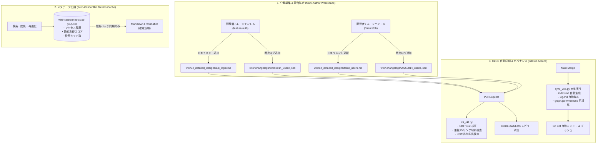
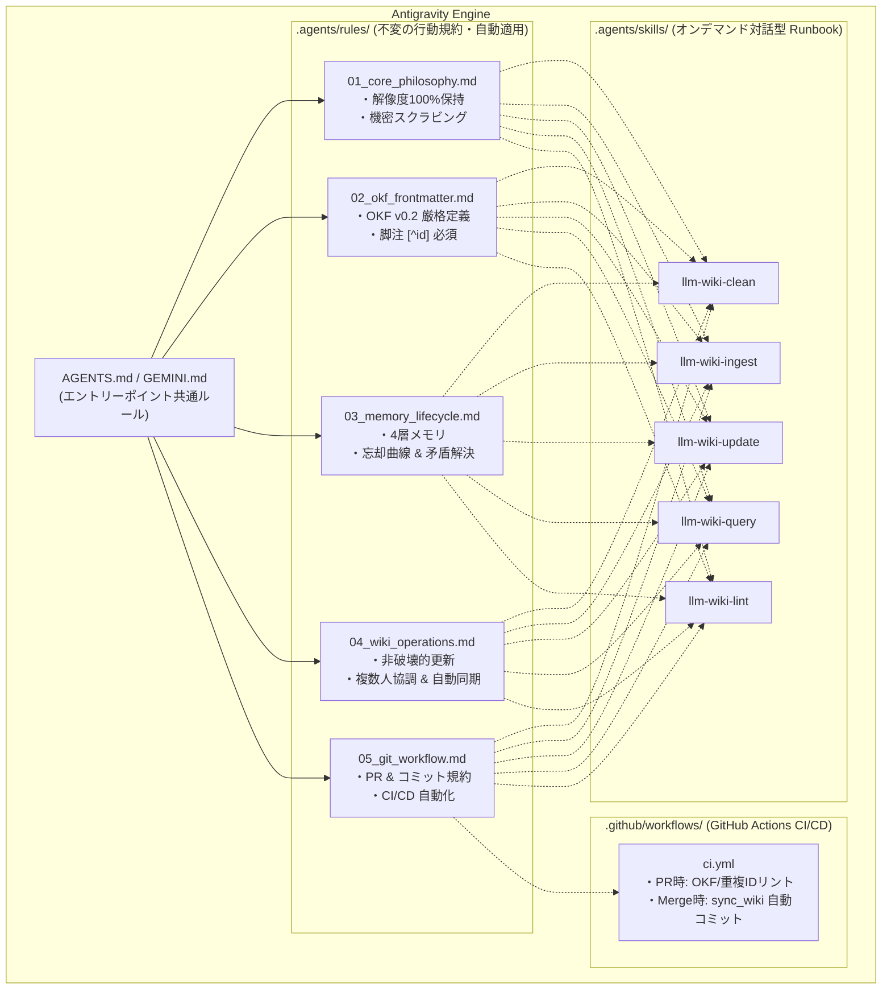

# LLM Wiki for Development Projects (Google OKF v0.2 & LLM Wiki v2 / Multi-User Compliant)

本リポジトリは、開発プロジェクトにおける各種ドキュメント（顧客要望、要件定義書、概要設計書、詳細設計書、ADR、議事録等）を、**LLM Wiki v2 概念**（忘却曲線、確信度スコア、4層メモリ階層、型付きナレッジグラフ、ハイブリッド検索、自動フック）および **Google OKF (Open Knowledge Format) v0.2** 仕様に基づいて一元管理・運用するための統合ナレッジベースです。

一次情報（Office / PDF / SQL / テキスト）を自動クレンジング・機密スクラビングして取り込み、人間と複数の AI エージェント（Antigravity）、複数人の開発者が**コンフリクトなく並行して協調編集・検索・検証できるマルチユーザー設計**を備えています。

---

## 📚 目次
1. [LLM Wiki v2 & マルチユーザー協調アーキテクチャ](#-llm-wiki-v2--マルチユーザー協調アーキテクチャ)
2. [複数人協調・コンフリクト完全排除ルール](#-複数人協調コンフリクト完全排除ルール)
3. [リポジトリ構成とフォルダの役割](#-リポジトリ構成とフォルダの役割)
4. [Antigravity Rules & ワークフロー統合](#-antigravity-rules--ワークフロー統合)
5. [OKF v0.2 & LLM Wiki v2 Frontmatter 仕様](#-okf-v02--llm-wiki-v2-frontmatter-仕様)
6. [Antigravity Skills の使い方](#-antigravity-skills-の使い方)
7. [CLI 支援ツールの使い方](#-cli-支援ツールの使い方)
8. [Git & GitHub CI/CD 運用フロー](#-git--github-cicd-運用フロー)

---

## 💡 LLM Wiki v2 & マルチユーザー協調アーキテクチャ



### 1. 分散インデックス & 断片チェンジログ（Gitコンフリクト完全排除）
* **集中ファイルの手動編集廃止**: 各フォルダの `index.md` や全体の `log.md` はスクリプト（`build_indexes.py`, `build_changelog.py`）により自動生成されます。
* **Fragment ログ方式**: 作業者は `wiki/.changelogs/` に個別の断片 JSON ログを追加するだけであり、マージ時の競合が一切発生しません。

### 2. コンテンツ（Markdown）と動的メタデータの分離（SQLite キャッシュ）
* 検索ヒット、閲覧履歴、忘却曲線の再強化（Reinforce）によるアクセス情報は、Git 管理外のローカル SQLite（`wiki/.cache/metrics.db`）に記録されます。
* これにより、**「検索や閲覧を行うだけで Markdown が書き換わり Git 差分が多発する」問題を完全解決**しています。

### 3. Memory Lifecycle（4層メモリ階層 & 忘却曲線）
* **4層構造**: `working`（短期作業メモ） $\rightarrow$ `episodic`（議事録・セッション要約） $\rightarrow$ `semantic`（統合仕様・ADR） $\rightarrow$ `procedural`（運用Runbook・手順）。
* **エビングハウスの忘却曲線**: 放置された知識は時間経過で確信度スコアが指数関数的に減衰（Decay）。カテゴリ別に半減期（ADR: 346日、詳細設計: 69日、バグ/メモ: 14日）を設定。

### 4. Hybrid Search（ハイブリッド検索エンジン）
* **BM25**（キーワード）、**Semantic**（意味類似度）、**Knowledge Graph**（関係性近傍）の 3 手法を **Reciprocal Rank Fusion (RRF)** で統合し、鮮度（減衰後スコア）を加味した最高精度の検索結果を提供。

---

## 👥 複数人協調・コンフリクト完全排除ルール

複数ユーザー・複数エージェントが並行してドキュメントを編纂する際、以下の原則に従います。

### ① 集中ファイル（`index.md`, `log.md`, `graph.*`）の手動編集禁止
* 各作業者は、自身の担当する Concept ファイル（例: `wiki/04_detailed_designs/api_xxx.md`）と断片ログ（`wiki/.changelogs/`）のみをコミットします。
* `index.md` や `log.md`、`graph.json` は CI または `python3 scripts/sync_wiki.py` により自動生成されます。

### ② 仕様対立時の両論併記ルール（`contradicts` & ADR First）
* 異なるチームや機能間で仕様の不一致が発生した場合、**相手のドキュメントを無断で上書き・削除してはなりません**。
* 一時的に `relations.contradicts: [対象ファイル]` を付与して両論併記とし、`wiki/05_decisions/` に **ADR（アーキテクチャ決定記録）** を起票して合意形成を行います。
* ADR が確定した段階で、一方を `deprecated` / `superseded_by` に更新します。

### ③ 下書きステータス（`status: draft`）の運用
* 執筆途中のドキュメントは `status: draft` を設定します。
* CI（`lint_okf.py`）により、他ドキュメントが `draft` 状態のファイルに対して不正に `depends_on` 等の依存関係を結んでいないかを自動検知・警告します。

---

## 📁 リポジトリ構成とフォルダの役割

```text
llmwiki/
├── README.md                      # 本ドキュメント
├── SCHEMA.md                      # Wiki 編纂・データスキーマ完全仕様書
├── AGENTS.md                      # Antigravity エージェント自動適用 マスターガイドライン
├── GEMINI.md                      # Antigravity エージェント自動適用 マスターガイドライン (エイリアス)
├── .agents/
│   ├── rules/                     # 【Antigravity Rules】自動適用されるモジュール別品質・行動規約
│   │   ├── 01_core_philosophy.md  # 設計思想・解像度100%保持・機密スクラビング規約
│   │   ├── 02_okf_frontmatter.md  # OKF v0.2 & v2 Frontmatter 完全スキーマ・脚註規約
│   │   ├── 03_memory_lifecycle.md # 4層メモリ階層・忘却曲線・矛盾解決規約
│   │   ├── 04_wiki_operations.md  # 複数人協調・非破壊更新・自動同期オペレーション
│   │   └── 05_git_workflow.md     # トピックブランチ・コミット規約・CI/CD フロー
│   └── skills/                    # 【Antigravity Skills】オンデマンド対話型 Runbook
│       ├── llm-wiki-clean/        # Markdown 不要空欄・Excel空セル削除・シークレット除去
│       ├── llm-wiki-ingest/       # 一次資料取り込み・OKF v0.2 知識化・脚注付与
│       ├── llm-wiki-lint/         # OKF v0.2 整合性・ゴーストリンク・重複ID・グラフ検査
│       ├── llm-wiki-query/        # ハイブリッド検索・Graph Traversal・仕様回答
│       └── llm-wiki-update/       # 仕様変更・ADR 起票・忘却曲線再強化・世代交代
├── .github/
│   ├── CODEOWNERS                 # ドメイン別レビュー担当者定義
│   ├── pull_request_template.md   # OKF v0.2 & 複数人協調 PR テンプレート
│   └── workflows/
│       └── ci.yml                 # 【GitHub Actions】PR 時リント ＆ Merge 時自動同期
├── scripts/                       # 運用・同期スクリプト群
│   ├── sync_wiki.py               # 【統合】Index, Changelog, Knowledge Graph 一括自動同期
│   ├── build_indexes.py           # カテゴリ別 & マスター index.md 自動生成
│   ├── build_changelog.py         # 分散断片ログから wiki/log.md を自動集約・再生成
│   ├── build_graph.py             # ナレッジグラフ構築・Mermaid/JSON 出力・矛盾/孤立検査
│   ├── metrics_db.py              # SQLite 動的メトリクス管理モジュール (wiki/.cache/metrics.db)
│   ├── hybrid_search.py           # BM25 + Semantic + Graph + RRF ハイブリッド検索エンジン
│   ├── memory_decay.py            # 忘却曲線減衰計算・再強化・DB連携
│   ├── consolidate_memory.py      # 4層メモリ階層の昇格・要約・統合ツール
│   ├── convert_anydoc.py          # anydoc 変換 ＋ ルールベース前処理
│   ├── table_cleaner.py           # 表の空セル・空列・空行自動削除モジュール
│   └── lint_okf.py                # OKF v0.2 & マルチユーザー整合性自動バリデータ
├── raw/                           # 【一次資料保管庫】（人間が受領・配置した原本）
│   ├── 01_customer_requests/      # 顧客ヒアリングシート、RFP、要望一覧
│   ├── 02_requirements/           # システム要件定義書、業務フロー図
│   ├── 03_basic_designs/          # 基本設計書、システム構成図、外部IF仕様書
│   ├── 04_detailed_designs/       # 詳細設計書、DB定義 (Excel/DDL)、API仕様書
│   ├── 05_decisions/              # 意思決定の背景資料・比較検討資料
│   └── 99_others/                 # 参考技術資料、開発ガイドライン、議事録
└── wiki/                          # 【Google OKF v0.2 準拠 編集済み知識層】
    ├── index.md                   # 全体マスターインデックス（自動生成）
    ├── log.md                     # 全体更新履歴 (Changelog)（自動生成）
    ├── graph.json                 # ナレッジグラフデータ (JSON)（自動生成）
    ├── graph.mermaid              # ナレッジグラフ可視化 (Mermaid)（自動生成）
    ├── .changelogs/               # 分散断片ログ保管ディレクトリ (*.json)
    ├── 01_customer_requests/      # 顧客要望コンセプト群 (index.md 自動生成)
    ├── 02_requirements/           # 要件定義コンセプト群 (index.md 自動生成)
    ├── 03_basic_designs/          # 概要・基本設計コンセプト群 (index.md 自動生成)
    ├── 04_detailed_designs/       # 詳細設計コンセプト群 (DB/API/画面)
    ├── 05_decisions/              # アーキテクチャ決定記録 (ADR)
    └── 99_others/                 # プロジェクト共通用語集 (glossary.md) 等
```

---

## 🤖 Antigravity Rules & ワークフロー統合



### 🎯 エージェント行動の 5 大原則
1. **解像度の完全保持（最重要）**: 一次資料からの取り込み時、API パラメータ、DB カラム型、エラーコード等の詳細定義を絶対に要約省略しない。
2. **Google OKF v0.2 Frontmatter 必須**: `wiki/` 配下のすべてのファイルに完全な Frontmatter を付与。
3. **主張単位の根拠付け（Footnotes `[^id]`）**: 本文中の記述は `sources` の `id` と紐づく脚注記法で裏付けを明記。
4. **非破壊的更新の原則**: 仕様変更時は過去の記述を削除せず、取り消し線（`~~`）で残すか `supersedes` / `superseded_by` で安全に世代交代。
5. **複数人協調・自動同期（Decentralized Sync）**: `index.md` や `log.md` の手動編集はコンフリクトの原因となるため禁止。変更ログは `wiki/.changelogs/` に断片保存し、同期は `sync_wiki.py` または CI に委ねる。動的アクセス記録は `metrics.db` で分離管理する。

---

## 🏷️ OKF v0.2 & LLM Wiki v2 Frontmatter 仕様

```yaml
---
type: Database Table             # 【必須】概念種別
title: Users Table Specification # 【推奨】ドキュメント表示名
description: ユーザーマスタおよび認証情報のテーブル定義 # 【推奨】1行要約
tags: [auth, user, database]    # 【任意】分類・検索用タグ
status: active                   # 【推奨】draft | active | stale | deprecated | tombstone

# 1. Memory Lifecycle
memory_tier: semantic            # working | episodic | semantic | procedural
decay_rate: standard             # permanent (λ=0.002) | standard (λ=0.01) | volatile (λ=0.05)
last_reinforced_at: 2026-08-14T16:00:00Z # 最終確認・強化日時
access_count: 12                 # 参照回数

# 2. Confidence Scoring
confidence:
  base_score: 0.90               # 初期確信度 (0.0〜1.0)
  current_score: 0.90            # 忘却曲線減衰後の現在スコア
  factors:
    source_count: 2
    authority: high
    human_verified: true
    has_contradictions: false

# 3. 生成・検証情報
generated:
  by: agent:antigravity/gemini-3.7-flash
  at: 2026-08-14T16:00:00Z

verified:
  by: human:slee
  at: 2026-08-14T16:30:00Z
  method: manual_audit

# 4. 来歴 (Provenance)
sources:
  - id: user-schema-v1
    resource: raw/04_detailed_designs/user_schema.xlsx
    title: ユーザー設計書
    authority: high
    last_modified: 2026-08-14

# 5. ナレッジグラフ (Typed Relations)
relations:
  implements: [02_requirements/req_user_management]
  depends_on: [03_basic_designs/arch_auth_system]
  uses: [03_basic_designs/infra_postgresql]
  contradicts: []
---
```

---

## 🚀 Antigravity Skills の使い方

### 1. 資料の追加・Wiki 化 (`llm-wiki-ingest`)
一次資料（Excel, PDF, Word, SQL 等）を指定するだけで、不要な空セルや空行を自動クレンジングし、シークレットを除去した上で適切な `memory_tier`、初期確信度、`sources` ＋ 脚注を付与して取り込みます。
> **プロンプト例:** 「`raw/04_detailed_designs/db_schema.xlsx` を Wiki に追加してください。」

### 2. 質問・横断検索 (`llm-wiki-query`)
ハイブリッド検索（BM25 + セマンティック + グラフ近傍）を実行し、減衰後確信度、メモリ階層、Graph Traversal（`implements`, `depends_on` 等）を辿って根拠（Footnotes / Sources）付きで回答します。検索ヒットは `metrics.db` に自動記録されます。
> **プロンプト例:** 「パスワードロックの仕様と、関連するDBテーブル・API定義を教えてください。」

### 3. 仕様変更・世代交代 (`llm-wiki-update`)
仕様変更時に過去の記述を取り消し線（`~~`）で残しつつ更新し、忘却曲線を再強化（Reinforce）し、必要に応じて ADR 起票や旧ドキュメントの世代交代（`supersedes` / `superseded_by`）を行います。
> **プロンプト例:** 「パスワード失敗時のロック時間を15分から30分に変更してください。」

### 4. Wiki の整合性検査・修復 (`llm-wiki-lint`)
OKF v0.2 + v2 適合性、リンク切れ、重複ID、ドラフト不正依存、グラフの矛盾、減衰（stale）ドキュメントを検査・修復します。
> **プロンプト例:** 「Wiki 全体の整合性とナレッジグラフをチェックして更新してください。」

---

## 🛠️ CLI 支援ツールの使い方

### 1. Wiki 全体の一括自動同期 (`sync_wiki.py`)
インデックス生成、チェンジログ集約、ナレッジグラフ再構築をワンコマンドで実行します。
```bash
python3 scripts/sync_wiki.py
```

### 2. ハイブリッド検索 (`hybrid_search.py`)
BM25、セマンティック、グラフ走査を RRF で統合し、鮮度スコアを加味したランキングを出力します（検索履歴は `metrics.db` に記録）。
```bash
python3 scripts/hybrid_search.py "ユーザー認証 パスワードロック" --top 5
```

### 3. 忘却曲線 & メモリ減衰管理 (`memory_decay.py`)
```bash
# 全 Concept の忘却曲線減衰レポートを表示
python3 scripts/memory_decay.py wiki/

# 特定ドキュメントの忘却曲線を再強化 (Reinforce -> metrics.db に保存)
python3 scripts/memory_decay.py --reinforce wiki/04_detailed_designs/table_users.md

# SQLite に蓄積されたメトリクスを Markdown Frontmatter に確定書き戻し
python3 scripts/memory_decay.py wiki/ --sync-to-frontmatter
```

### 4. 分散チェンジログ管理 (`build_changelog.py`)
```bash
# 断片ログを手動追加
python3 scripts/build_changelog.py add "user:alice" "API仕様の追加" "ログインエンドポイントを追加" "JWTトークン検証を追加"

# 全断片ログを wiki/log.md に集約
python3 scripts/build_changelog.py
```

### 5. OKF v0.2 & マルチユーザー整合性バリデータ (`lint_okf.py`)
```bash
python3 scripts/lint_okf.py wiki/
```

---

## 🐙 Git & GitHub CI/CD 運用フロー

1. **トピックブランチ作成**:
   - `feature/ingest-<topic>`, `feature/update-<topic>`, `docs/adr-<number>` 等のブランチで作業。
2. **作業とコミット**:
   - ドキュメント本体および `wiki/.changelogs/` の断片ログを作成してコミット。
   - `wiki/log.md` や `index.md` の手動編集は不要（コンフリクト回避）。
3. **Pull Request & CI 自動検証**:
   - PR を作成すると、GitHub Actions (`.github/workflows/ci.yml`) により `python3 scripts/lint_okf.py wiki/` が自動実行され、OKF 構文、重複ID、リンク切れ、ドラフト依存がチェックされます。
   - `CODEOWNERS` に基づき、各ドメインの担当者がレビュー・承認。
4. **Main マージ & 自動同期コミット**:
   - PR が `main` にマージされると、GitHub Actions が自動で `python3 scripts/sync_wiki.py` を実行し、最新の `index.md`, `log.md`, `graph.json`, `graph.mermaid` を自動生成してコミット＆プッシュします。
