# LLM Wiki for Development Projects (Google OKF v0.2 & LLM Wiki v2 準拠)

本リポジトリは、開発プロジェクトにおける各種ドキュメント（顧客要望、要件定義書、概要設計書、詳細設計書、ADR、議事録等）を、**LLM Wiki v2 概念**（忘却曲線、確信度スコア、4層メモリ階層、型付きナレッジグラフ、ハイブリッド検索、自動フック）および **Google OKF (Open Knowledge Format) v0.2** 仕様に基づいて一元管理・運用するための統合ナレッジベースです。

一次情報（Office / PDF / SQL / テキスト）を自動クレンジング・機密スクラビングして取り込み、人間と AI エージェント（Antigravity）が協調して高精度に閲覧・更新・検索・検査できる環境を提供します。

---

## 📚 目次
1. [LLM Wiki v2 の 4 大コア概念](#-llm-wiki-v2-の-4-大コア概念)
2. [リポジトリ構成とフォルダの役割](#-リポジトリ構成とフォルダの役割)
3. [OKF v0.2 & LLM Wiki v2 Frontmatter 仕様](#-okf-v02--llm-wiki-v2-frontmatter-仕様)
4. [Antigravity Skills の使い方](#-antigravity-skills-の使い方)
5. [CLI 支援ツールの使い方](#-cli-支援ツールの使い方)
6. [運用ルールと品質規約 (Rules & Guidelines)](#-運用ルールと品質規約-rules--guidelines)
7. [Git & GitHub 運用フロー](#-git--github-運用フロー)

---

## 💡 LLM Wiki v2 の 4 大コア概念

```mermaid
flowchart TD
    subgraph "1. Memory Lifecycle (4層構造 & 忘却曲線)"
        WM["Working Memory (未整理メモ/観察)"] -->|要約・圧縮| EM["Episodic Memory (セッション要約/議事録)"]
        EM -->|統合・抽象化| SM["Semantic Memory (仕様/設計/ADR)"]
        SM -->|パターン抽出| PM["Procedural Memory (手順書/Runbook/Skill)"]
        SM -.->|時間経過| Decay["Forgetting Curve (減衰) S = C × exp(-λt)"]
        Decay -.->|再確認/アクセス| Reinforce["Reinforce (再強化/リセット)"]
        Reinforce --> SM
    end

    subgraph "2. Confidence Scoring & 矛盾解決"
        CS["Confidence Score (0.0〜1.0)<br/>ソース数・権威性・人間検証"] --> Resolv["矛盾解決 (Contradiction Resolution)<br/>新旧比較 & Supersession"]
    end

    subgraph "3. Knowledge Graphs"
        Entities["Typed Entities"] --- Relations["Typed Relations<br/>(implements, depends_on, uses, contradicts)"]
        Relations --> KGExport["Mermaid / JSON 可視化 & 影響範囲走査"]
    end

    subgraph "4. Hybrid Search (統合検索)"
        Query["開発者の自然言語クエリ"] --> BM25["BM25 (語彙/コード/N-gram)"]
        Query --> Sem["Semantic (概念/意味類似度)"]
        Query --> GraphWalk["Graph Proximity (関係性近傍)"]
        BM25 --> RRF["Reciprocal Rank Fusion (RRF 統合)"]
        Sem --> RRF
        GraphWalk --> RRF
        RRF --> Ranked["確信度加重 高精度検索結果"]
    end
```



### 1. Memory Lifecycle（4層メモリ階層 & 忘却曲線）
- **4層構造**: `working`（短期作業メモ） $\rightarrow$ `episodic`（議事録・セッション要約） $\rightarrow$ `semantic`（統合仕様・ADR） $\rightarrow$ `procedural`（運用Runbook・手順）。
- **エビングハウスの忘却曲線**: 放置された知識は時間とともに確信度スコアが指数関数的に減衰（Decay）。カテゴリ別に半減期（ADR: 346日、詳細設計: 69日、バグ/メモ: 14日）を設定。参照や再検証で自動リセット＆強化（Reinforce）。

### 2. Confidence Scoring（確信度スコア & 矛盾解決）
- 各 Concept に 0.0〜1.0 の確信度スコアを付与（ソース数、権威性、人間による監査 `verified`、経過日数）。
- 矛盾（`contradicts`）が発生した場合、ソースの権威性と新しさを比較して新世代へ安全に置換（Supersession）。

### 3. Knowledge Graphs（型付きエンティティ & 型付き関係）
- `implements`, `depends_on`, `uses`, `contradicts`, `supersedes` などのセマンティックな関係性をフロントマターで定義。
- 機械可読なグラフデータ（`wiki/graph.json`）および視覚的な Mermaid 図（`wiki/graph.mermaid`）を自動生成し、影響範囲を探索。

### 4. Hybrid Search（ハイブリッド検索エンジン）
- ページ数が膨大になっても、**BM25**（キーワード）、**Semantic**（意味類似度）、**Knowledge Graph**（関係性近傍）の 3 つの手法を **Reciprocal Rank Fusion (RRF)** で統合し、鮮度（減衰後スコア）を加味した最高精度の検索結果を提供。

---

## 📁 リポジトリ構成とフォルダの役割

```text
llmwiki/
├── README.md                      # 本ドキュメント
├── SCHEMA.md                      # AI エージェント用 Wiki 編纂ルール (OKF v0.2 & v2 準拠)
├── .agents/
│   └── skills/                    # Antigravity 専用スキル群
│       ├── llm-wiki-clean/        # Markdown 不要空欄・Excel空セル削除・構造整形・シークレット除去
│       ├── llm-wiki-ingest/       # 一次資料取り込み・OKF v0.2 知識化・脚注・初期確信度付与
│       ├── llm-wiki-lint/         # OKF v0.2 整合性・ゴーストリンク・脚注・グラフ検査
│       ├── llm-wiki-query/        # ハイブリッド検索・Graph Traversal・仕様回答
│       └── llm-wiki-update/       # 仕様変更・ADR 起票・忘却曲線再強化・世代交代
├── scripts/                       # 運用スクリプト群
│   ├── hybrid_search.py           # BM25 + Semantic + Graph + RRF ハイブリッド検索エンジン
│   ├── memory_decay.py            # 忘却曲線減衰計算・再強化・stale 知識レポート
│   ├── build_graph.py             # ナレッジグラフ構築・Mermaid/JSON 出力・矛盾/孤立検査
│   ├── consolidate_memory.py      # 4層メモリ階層の昇格・要約・統合ツール
│   ├── convert_anydoc.py          # anydoc 変換 ＋ ルールベース前処理
│   ├── table_cleaner.py           # 表の空セル・空列・空行自動削除モジュール
│   └── lint_okf.py                # OKF v0.2 & LLM Wiki v2 自動バリデータ
├── raw/                           # 【一次資料保管庫】（人間が受領・配置した原本）
│   ├── 01_customer_requests/      # 顧客ヒアリングシート、RFP、要望一覧
│   ├── 02_requirements/           # システム要件定義書、業務フロー図
│   ├── 03_basic_designs/          # 基本設計書、システム構成図、外部IF仕様書
│   ├── 04_detailed_designs/       # 詳細設計書、DB定義 (Excel/DDL)、API仕様書
│   ├── 05_decisions/              # 意思決定の背景資料・比較検討資料
│   └── 99_others/                 # 参考技術資料、開発ガイドライン、議事録
└── wiki/                          # 【Google OKF v0.2 準拠 編集済み知識層】
    ├── index.md                   # 全体マスターインデックス
    ├── log.md                     # 全体更新履歴 (Changelog)
    ├── graph.json                 # ナレッジグラフデータ (JSON)
    ├── graph.mermaid              # ナレッジグラフ可視化 (Mermaid)
    ├── 01_customer_requests/      # 顧客要望コンセプト群 (index.md 完備)
    ├── 02_requirements/           # 要件定義コンセプト群 (index.md 完備)
    ├── 03_basic_designs/          # 概要・基本設計コンセプト群 (index.md 完備)
    ├── 04_detailed_designs/       # 詳細設計コンセプト群 (DB/API/画面)
    ├── 05_decisions/              # アーキテクチャ決定記録 (ADR)
    └── 99_others/                 # プロジェクト共通用語集 (glossary.md) 等
```

---

## 🏷️ OKF v0.2 & LLM Wiki v2 Frontmatter 仕様

```yaml
---
type: Database Table             # 【必須】概念種別
title: Users Table Specification # 【推奨】ドキュメント表示名
description: ユーザーマスタおよび認証情報のテーブル定義 # 【推奨】1行要約
tags: [auth, user, database]    # 【任意】分類・検索用タグ
status: active                   # 【推奨】draft | active | stale | deprecated | tombstone

# 1. Memory Lifecycle
memory_tier: semantic            # working | episodic | semantic | procedural
decay_rate: standard             # permanent (λ=0.002) | standard (λ=0.01) | volatile (λ=0.05)
last_reinforced_at: 2026-08-14T16:00:00Z # 最終確認・強化日時
access_count: 12                 # 参照回数

# 2. Confidence Scoring
confidence:
  base_score: 0.90               # 初期確信度 (0.0〜1.0)
  current_score: 0.90            # 忘却曲線減衰後の現在スコア
  factors:
    source_count: 2
    authority: high
    human_verified: true
    has_contradictions: false

# 3. 生成・検証情報
generated:
  by: agent:antigravity/gemini-3.7-flash
  at: 2026-08-14T16:00:00Z

verified:
  by: human:slee
  at: 2026-08-14T16:30:00Z
  method: manual_audit

# 4. 来歴 (Provenance)
sources:
  - id: user-schema-v1
    resource: raw/04_detailed_designs/user_schema.xlsx
    title: ユーザー設計書
    authority: high
    last_modified: 2026-08-14

# 5. ナレッジグラフ (Typed Relations)
relations:
  implements: [02_requirements/req_user_management]
  depends_on: [03_basic_designs/arch_auth_system]
  uses: [03_basic_designs/infra_postgresql]
  contradicts: []
---
```

---

## 🛠️ CLI 支援ツールの使い方

### 1. ハイブリッド検索 (`hybrid_search.py`)
BM25、セマンティック、グラフ走査を RRF で統合し、鮮度スコアを加味したランキングを出力します。
```bash
python3 scripts/hybrid_search.py "ユーザー認証 パスワードロック" --top 5
```

### 2. 忘却曲線 & メモリ減衰管理 (`memory_decay.py`)
```bash
# 全 Concept の忘却曲線減衰レポートを表示
python3 scripts/memory_decay.py wiki/

# フロントマターの current_score を最新の減衰スコアに更新
python3 scripts/memory_decay.py wiki/ --update

# 特定ドキュメントの忘却曲線をリセット・再強化 (Reinforce)
python3 scripts/memory_decay.py --reinforce wiki/04_detailed_designs/table_users.md
```

### 3. ナレッジグラフ生成・可視化・分析 (`build_graph.py`)
```bash
# graph.json & graph.mermaid を生成し、孤立ノードや矛盾を検査
python3 scripts/build_graph.py wiki/
```

### 4. メモリ階層管理・統合 (`consolidate_memory.py`)
```bash
# 4層メモリ階層 (Working / Episodic / Semantic / Procedural) の分布を表示
python3 scripts/consolidate_memory.py wiki/

# ドキュメントを上位階層に昇格
python3 scripts/consolidate_memory.py --promote wiki/01_customer_requests/hearing_sheet.md episodic
```

### 5. OKF v0.2 & v2 整合性バリデータ (`lint_okf.py`)
```bash
python3 scripts/lint_okf.py wiki/
```

---

## 🚀 Antigravity Skills の使い方

Antigravity IDE のチャット画面から、自然な指示を出すだけで、AI エージェントが自律的に実行します。

### 1. 資料の追加・Wiki 化 (`llm-wiki-ingest`)
一次資料（Excel, PDF, Word, SQL 等）を指定するだけで、不要な空セルや空行を自動クレンジングし、シークレットを除去した上で適切な `memory_tier`、初期確信度、`sources` ＋ 脚注を付与して取り込みます。
> **プロンプト例:** 「`raw/04_detailed_designs/db_schema.xlsx` を Wiki に追加してください。」

### 2. 質問・横断検索 (`llm-wiki-query`)
ハイブリッド検索（BM25 + セマンティック + グラフ近傍）を実行し、減衰後確信度、メモリ階層、Graph Traversal（`implements`, `depends_on` 等）を辿って根拠（Footnotes / Sources）付きで回答します。
> **プロンプト例:** 「パスワードロックの仕様と、関連するDBテーブル・API定義を教えてください。」

### 3. 仕様変更・世代交代 (`llm-wiki-update`)
仕様変更時に過去の記述を取り消し線（`~~`）で残しつつ更新し、忘却曲線を再強化（Reinforce）し、必要に応じて ADR 起票や旧ドキュメントの世代交代（`supersedes` / `superseded_by`）を行います。
> **プロンプト例:** 「パスワード失敗時のロック時間を15分から30分に変更してください。」

### 4. Wiki の整合性検査・修復 (`llm-wiki-lint`)
OKF v0.2 + v2 適合性、リンク切れ、グラフの矛盾、減衰（stale）ドキュメントを検査・修復します。
> **プロンプト例:** 「Wiki 全体の整合性とナレッジグラフをチェックして更新してください。」

---

## 🐙 Git & GitHub 運用フロー

1. **ブランチ運用**: 新規資料の取り込みや仕様更新はトピックブランチ（例: `feature/ingest-auth-spec`）で作業。
2. **CI / CD (GitHub Actions)**: Pull Request 時に `python3 scripts/lint_okf.py wiki/` および `python3 scripts/build_graph.py wiki/` を実行し、整合性とナレッジグラフの健全性を自動検証します。
