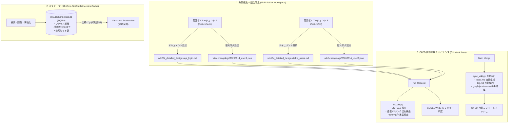
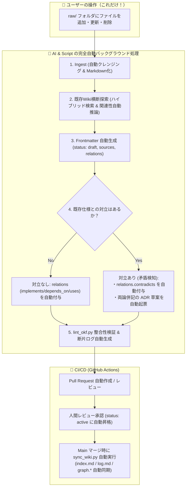
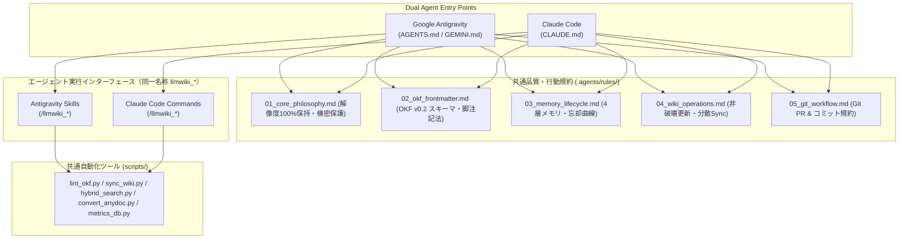
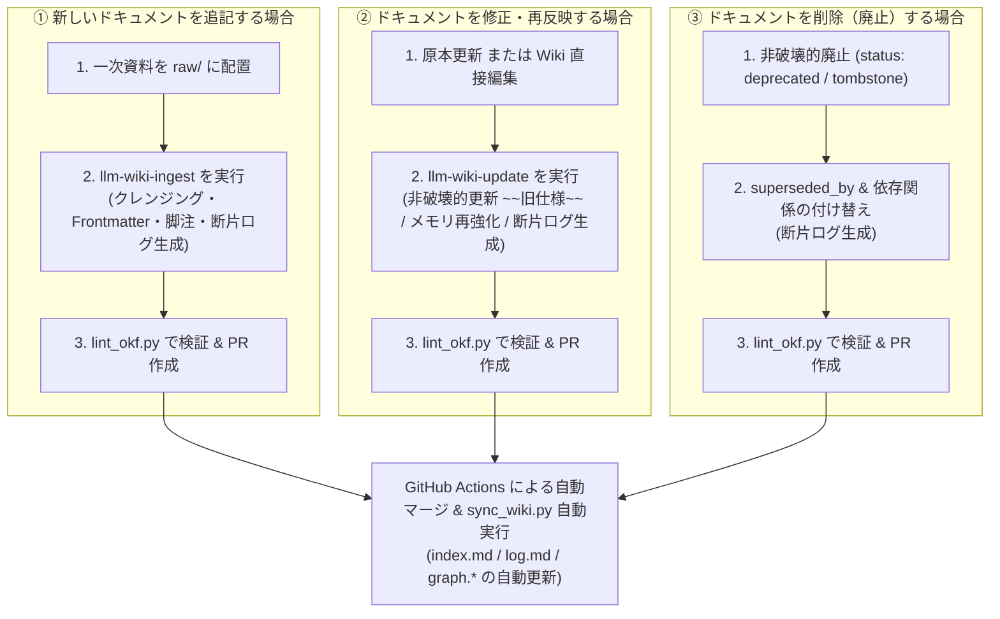

# LLM Wiki for Development Projects (Google OKF v0.2 & LLM Wiki v2 / Multi-User & Dual Agent Compliant)

本リポジトリは、開発プロジェクトにおける各種ドキュメント（顧客要望、要件定義書、概要設計書、詳細設計書、ADR、議事録等）を、**LLM Wiki v2 概念**（忘却曲線、確信度スコア、4層メモリ階層、型付きナレッジグラフ、ハイブリッド検索、自動フック）および **Google OKF (Open Knowledge Format) v0.2** 仕様に基づいて一元管理・運用するための統合ナレッジベースです。

一次情報（Office / PDF / SQL / テキスト）を自動クレンジング・機密スクラビングして取り込み、人間と複数の AI エージェント（**Google Antigravity** & **Claude Code**）、複数人の開発者が**コンフリクトなく並行して協調編集・検索・検証できるマルチユーザー・デュアルエージェント設計**を備えています。

---

## 📚 目次
1. [LLM Wiki v2 & マルチユーザー協調アーキテクチャ](#-llm-wiki-v2--マルチユーザー協調アーキテクチャ)
2. [複数人協調・コンフリクト完全排除ルール](#-複数人協調コンフリクト完全排除ルール)
3. [リポジトリ構成とフォルダの役割](#-リポジトリ構成とフォルダの役割)
4. [AI エージェント統合 (Antigravity & Claude Code)](#-ai-エージェント統合-antigravity--claude-code)
5. [OKF v0.2 & LLM Wiki v2 Frontmatter 仕様](#-okf-v02--llm-wiki-v2-frontmatter-仕様)
6. [エージェント操作・スラッシュコマンド & Skills](#-エージェント操作スラッシュコマンド--skills)
7. [CLI 支援ツールの使い方](#-cli-支援ツールの使い方)
8. [Wiki 基本操作ガイド（追加・修正・削除の流れ）](#-wiki-基本操作ガイド追加修正削除の流れ)
9. [Git & GitHub CI/CD 運用フロー](#-git--github-cicd-運用フロー)

---

## 💡 LLM Wiki v2 & マルチユーザー協調アーキテクチャ



### 1. 分散インデックス & 断片チェンジログ（Gitコンフリクト完全排除）
* **集中ファイルの手動編集廃止**: 各フォルダの `index.md` や全体の `log.md` はスクリプト（`build_indexes.py`, `build_changelog.py`）により自動生成されます。
* **Fragment ログ方式**: 作業者は `wiki/.changelogs/` に個別の断片 JSON ログを追加するだけであり、マージ時の競合が一切発生しません。

### 2. コンテンツ（Markdown）と動的メタデータの分離（SQLite キャッシュ）
* 検索ヒット、閲覧履歴、忘却曲線の再強化（Reinforce）によるアクセス情報は、Git 管理外のローカル SQLite（`wiki/.cache/metrics.db`）に記録されます。
* これにより、**「検索や閲覧を行うだけで Markdown が書き換わり Git 差分が多発する」問題を完全解決**しています。

### 3. Memory Lifecycle（4層メモリ階層 & 忘却曲線）
* **4層構造**: `working`（短期作業メモ） $\rightarrow$ `episodic`（議事録・セッション要約） $\rightarrow$ `semantic`（統合仕様・ADR） $\rightarrow$ `procedural`（運用Runbook・手順）。
* **エビングハウスの忘却曲線**: 放置された知識は時間経過で確信度スコアが指数関数的に減衰（Decay）。カテゴリ別に半減期（ADR: 346日、詳細設計: 69日、バグ/メモ: 14日）を設定。

### 4. Hybrid Search（ハイブリッド検索エンジン）
* **BM25**（キーワード）、**Semantic**（意味類似度）、**Knowledge Graph**（関係性近傍）の 3 手法を **Reciprocal Rank Fusion (RRF)** で統合し、鮮度（減衰後スコア）を加味した最高精度の検索結果を提供。

---

## 👥 複数人協調・コンフリクト完全排除ルール

本ナレッジベースの最大の特徴は、**「ユーザーは `raw/` フォルダにファイルを配置・修正・削除するだけで、複雑なメタデータ設定やコンフリクト解決は AI とスクリプトが全自動で処理する（ゼロタッチ運用）」** 点にあります。

複数ユーザー・複数エージェントが並行して作業する際、以下の自動化メカニズムとルールが適用されます。



---

### ① `relations` の具体的な設定方法と意味

`relations` は、ドキュメント間の関係性を型付きナレッジグラフとして表現するフィールドです。**通常は AI（`llm-wiki-ingest`）が既存ドキュメントを検索して自動推論・自動設定**しますが、手動設定する場合は以下のルールに従います。

* **パス指定の形式**: `wiki/` からの相対パス（拡張子 `.md` は省略可）。
  - 例: `02_requirements/req_auth_system`, `04_detailed_designs/api_login`

```yaml
relations:
  # 【実現関係】どの要件や上位設計を実現・具体化しているか
  implements: 
    - 02_requirements/req_user_management
    - 03_basic_designs/arch_auth_system

  # 【依存関係】この仕様が成立するために前提となる上位・関連設計
  depends_on: 
    - 03_basic_designs/infra_postgresql
    - 04_detailed_designs/table_users

  # 【利用関係】この仕様が参照・利用する外部モジュールや共通仕様
  uses: 
    - 99_others/glossary
    - 04_detailed_designs/api_auth_token

  # 【対立・矛盾関係】仕様の不一致や対立が存在するドキュメント（ADRで解決するまで一時指定）
  contradicts: 
    - 04_detailed_designs/legacy_auth_spec
```

---

### ② 複数ユーザー同時追加時の「仕様対立」はどう検知・設定されるか？

同時に作業しているユーザー同士は、追加した時点では他者の変更や仕様の不一致（例: パスワード最小文字数が 8 文字 vs 12 文字、カラム型の違い等）を把握できません。
この問題は、**AI と CI の「自動関係性推論」および「セマンティック矛盾検出」** により完全に自動化されます。

#### 1. AI による取り込み時の自動関係性推論 (Auto-Relation Inference)
* ユーザーが `raw/` にファイルを置くと、AI（`llm-wiki-ingest`）は `scripts/hybrid_search.py` を内部実行し、Wiki 内の既存ドキュメントを横断検索（キーワード＋意味類似度）します。
* 類似度や意味的文脈の高い上位ドキュメントを特定し、`implements`, `depends_on`, `uses` を**自動判定して Frontmatter に設定**します。

#### 2. 仕様対立の自動検知と両論併記 (Auto-Conflict & Contradiction Detection)
* AI は新ドキュメントの内容と、既存の関連ドキュメントの記述を比較・検証します。
* **矛盾（値やルールの食い違い）が発見された場合**:
  1. 相手のドキュメントを勝手に上書き・削除せず、新ドキュメントの `relations.contradicts: [対象ドキュメント]` に自動設定します。
  2. `wiki/05_decisions/adr_draft_YYYYMMDD_<topic>.md`（ADR の草案）を自動作成し、両方の仕様の違い・論点・提案を両論併記でまとめます。
  3. PR 作成時に「⚠️ 仕様対立が検知されました」とレビュアーに自動通知します。

#### 3. PR / CI レベルでの重複・矛盾検知
* 複数人が同時に PR を出した場合でも、GitHub Actions の `lint_okf.py` がマージ前にグラフ全体の循環参照、重複 ID、未解決の `contradicts` を自動検証し、安全な統合を保証します。

---

### ③ 下書きステータス（`status: draft`）の自動ライフサイクル運用

ドキュメントの品質と信頼性を保つため、ステータスは以下のように自動管理されます。

| ステータス | 状態の説明 | 自動化トリガー |
| :--- | :--- | :--- |
| **`draft`** | 下書き・取り込み直後（レビュー待ち） | `raw/` から取り込んだ直後に **AI が自動設定**。他ドキュメントからの不正な依存（`depends_on`）は CI で警告。 |
| **`active`** | 本番仕様（承認済み・高信頼性） | PR レビューで `LGTM` または人間による検証（`verified.by`）完了時に **CI / AI が自動昇格**。 |
| **`stale`** | 鮮度低下（要再確認） | 忘却曲線により `current_score < 0.50` に減衰したドキュメントを **`memory_decay.py` が自動検知**。 |
| **`deprecated`** | 廃止・後継あり | 新ドキュメントが `supersedes` を指定してマージされた際に **旧ドキュメントへ自動反映**。 |
| **`tombstone`** | 完全に破棄された仕様 | 削除・廃棄された仕様の墓標として保持。 |

---

### ④ 集中ファイル（`index.md`, `log.md`, `graph.*`）の手動編集禁止
* 各作業者・エージェントは Concept ファイルと断片ログ（`wiki/.changelogs/`）のみを操作します。
* `index.md` や `log.md`、`graph.json` は `sync_wiki.py` または GitHub Actions CI が自動生成するため、Git コンフリクトが原理的に発生しません。

---

## 📁 リポジトリ構成とフォルダの役割

```text
llmwiki/
├── README.md                      # 本ドキュメント
├── SCHEMA.md                      # Wiki 編纂・データスキーマ完全仕様書
├── CLAUDE.md                      # 【Claude Code】マスター指示・ガイドライン
├── AGENTS.md                      # 【Google Antigravity】マスター指示・ガイドライン
├── GEMINI.md                      # 【Google Antigravity】マスター指示 (エイリアス)
├── .claude/
│   └── commands/                  # 【Claude Code】カスタムスラッシュコマンド定義
│       ├── llmwiki_ingest.md      # /llmwiki_ingest: 一次資料取り込み・OKF知識化
│       ├── llmwiki_query.md       # /llmwiki_query: ハイブリッド検索・仕様回答
│       ├── llmwiki_update.md      # /llmwiki_update: 仕様更新・ADR起票・世代交代
│       ├── llmwiki_lint.md        # /llmwiki_lint: OKF整合性・忘却曲線検査
│       ├── llmwiki_clean.md       # /llmwiki_clean: Markdown表クレンジング・機密マスク
│       └── llmwiki_sync.md        # /llmwiki_sync: index/log/graph 一括自動再構築
├── .agents/
│   ├── rules/                     # 【Antigravity Rules】自動適用されるモジュール別品質・行動規約
│   │   ├── 01_core_philosophy.md  # 設計思想・解像度100%保持・機密スクラビング規約
│   │   ├── 02_okf_frontmatter.md  # OKF v0.2 & v2 Frontmatter 完全スキーマ・脚註規約
│   │   ├── 03_memory_lifecycle.md # 4層メモリ階層・忘却曲線・矛盾解決規約
│   │   ├── 04_wiki_operations.md  # 複数人協調・非破壊更新・自動同期オペレーション
│   │   └── 05_git_workflow.md     # トピックブランチ・コミット規約・CI/CD フロー
│   └── skills/                    # 【Antigravity Skills】オンデマンド対話型 Runbook
│       ├── llmwiki_clean/         # Markdown 不要空欄・Excel空セル削除・シークレット除去
│       ├── llmwiki_ingest/        # 一次資料取り込み・OKF v0.2 知識化・脚注付与
│       ├── llmwiki_lint/          # OKF v0.2 整合性・ゴーストリンク・重複ID・グラフ検査
│       ├── llmwiki_query/         # ハイブリッド検索・Graph Traversal・仕様回答
│       ├── llmwiki_update/        # 仕様変更・ADR 起票・忘却曲線再強化・世代交代
│       └── llmwiki_sync/          # index/log/graph 一括自動再構築スキル
├── .github/
│   ├── CODEOWNERS                 # ドメイン別レビュー担当者定義
│   ├── pull_request_template.md   # OKF v0.2 & 複数人協調 PR テンプレート
│   └── workflows/
│       └── ci.yml                 # 【GitHub Actions】PR 時リント ＆ Merge 時自動同期
├── scripts/                       # 運用・同期スクリプト群
│   ├── sync_wiki.py               # 【統合】Index, Changelog, Knowledge Graph 一括自動同期
│   ├── build_indexes.py           # カテゴリ別 & マスター index.md 自動生成
│   ├── build_changelog.py         # 分散断片ログから wiki/log.md を自動集約・再生成
│   ├── build_graph.py             # ナレッジグラフ構築・Mermaid/JSON 出力・矛盾/孤立検査
│   ├── metrics_db.py              # SQLite 動的メトリクス管理モジュール (wiki/.cache/metrics.db)
│   ├── hybrid_search.py           # BM25 + Semantic + Graph + RRF ハイブリッド検索エンジン
│   ├── memory_decay.py            # 忘却曲線減衰計算・再強化・DB連携
│   ├── consolidate_memory.py      # 4層メモリ階層の昇格・要約・統合ツール
│   ├── convert_anydoc.py          # anydoc 変換 ＋ ルールベース前処理
│   ├── table_cleaner.py           # 表の空セル・空列・空行自動削除モジュール
│   └── lint_okf.py                # OKF v0.2 & マルチユーザー整合性自動バリデータ
├── raw/                           # 【一次資料保管庫】（人間が受領・配置した原本）
│   ├── 01_customer_requests/      # 顧客ヒアリングシート、RFP、要望一覧
│   ├── 02_requirements/           # システム要件定義書、業務フロー図
│   ├── 03_basic_designs/          # 基本設計書、システム構成図、外部IF仕様書
│   ├── 04_detailed_designs/       # 詳細設計書、DB定義 (Excel/DDL)、API仕様書
│   ├── 05_decisions/              # 意思決定の背景資料・比較検討資料
│   └── 99_others/                 # 参考技術資料、開発ガイドライン、議事録
└── wiki/                          # 【Google OKF v0.2 準拠 編集済み知識層】
    ├── index.md                   # 全体マスターインデックス（自動生成）
    ├── log.md                     # 全体更新履歴 (Changelog)（自動生成）
    ├── graph.json                 # ナレッジグラフデータ (JSON)（自動生成）
    ├── graph.mermaid              # ナレッジグラフ可視化 (Mermaid)（自動生成）
    ├── .changelogs/               # 分散断片ログ保管ディレクトリ (*.json)
    ├── 01_customer_requests/      # 顧客要望コンセプト群 (index.md 自動生成)
    ├── 02_requirements/           # 要件定義コンセプト群 (index.md 自動生成)
    ├── 03_basic_designs/          # 概要・基本設計コンセプト群 (index.md 自動生成)
    ├── 04_detailed_designs/       # 詳細設計コンセプト群 (DB/API/画面)
    ├── 05_decisions/              # アーキテクチャ決定記録 (ADR)
    └── 99_others/                 # プロジェクト共通用語集 (glossary.md) 等
```

---

## 🤖 AI エージェント統合 (Antigravity & Claude Code)

本リポジトリは、**Google Antigravity**（Gemini 搭載）と **Claude Code**（Anthropic CLI）の双方で同一の品質・動作仕様を保証するデュアル対応アーキテクチャを採用しています。



### 🎯 エージェント行動の 5 大原則（全エージェント共通）
1. **解像度の完全保持（最重要 / Zero Information Loss）**: 一次資料からの取り込み時、API パラメータ、DB カラム型、エラーコード等の詳細定義を絶対に要約省略しない。
2. **Google OKF v0.2 Frontmatter 必須**: `wiki/` 配下のすべてのファイルに完全な Frontmatter を付与。
3. **主張単位の根拠付け（Footnotes `[^id]`）**: 本文中の記述は `sources` の `id` と紐づく脚注記法で裏付けを明記。
4. **非破壊的更新の原則**: 仕様変更時は過去の記述を削除せず、取り消し線（`~~`）で残すか `supersedes` / `superseded_by` で安全に世代交代。
5. **複数人協調・自動同期（Decentralized Sync）**: `index.md` や `log.md` の手動編集はコンフリクトの原因となるため禁止。変更ログは `wiki/.changelogs/` に断片保存し、同期は `sync_wiki.py` または CI に委ねる。動的アクセス記録は `metrics.db` で分離管理する。

---

## 🏷️ OKF v0.2 & LLM Wiki v2 Frontmatter 仕様

```yaml
---
type: Database Table             # 【必須】概念種別
title: Users Table Specification # 【推奨】ドキュメント表示名
description: ユーザーマスタおよび認証情報のテーブル定義 # 【推奨】1行要約
tags: [auth, user, database]    # 【任意】分類・検索用タグ
status: active                   # 【推奨】draft | active | stale | deprecated | tombstone

# 1. Memory Lifecycle
memory_tier: semantic            # working | episodic | semantic | procedural
decay_rate: standard             # permanent (λ=0.002) | standard (λ=0.01) | volatile (λ=0.05)
last_reinforced_at: 2026-08-17T16:00:00Z # 最終確認・強化日時
access_count: 12                 # 参照回数

# 2. Confidence Scoring
confidence:
  base_score: 0.90               # 初期確信度 (0.0〜1.0)
  current_score: 0.90            # 忘却曲線減衰後の現在スコア
  factors:
    source_count: 2
    authority: high
    human_verified: true
    has_contradictions: false

# 3. 生成・検証情報
generated:
  by: agent:claude-code/claude-3-7-sonnet  # または agent:antigravity/gemini-3.7-flash
  at: 2026-08-17T16:00:00Z

verified:
  by: human:slee
  at: 2026-08-17T16:30:00Z
  method: manual_audit

# 4. 来歴 (Provenance)
sources:
  - id: user-schema-v1
    resource: raw/04_detailed_designs/user_schema.xlsx
    title: ユーザー設計書
    authority: high
    last_modified: 2026-08-17

# 5. ナレッジグラフ (Typed Relations)
relations:
  implements: [02_requirements/req_user_management]
  depends_on: [03_basic_designs/arch_auth_system]
  uses: [03_basic_designs/infra_postgresql]
  contradicts: []
---
```

---

## 🚀 エージェント操作・スラッシュコマンド & Skills

Google Antigravity の対話スキル（Skills）と、Claude Code のスラッシュコマンド（Commands）は `llmwiki_` プレフィックス付きの同一名称で統一されています。

| 操作 | Claude Code コマンド | Antigravity スキル (`/` 呼び出し可) | 説明 |
| :--- | :--- | :--- | :--- |
| **資料取り込み** | `/llmwiki_ingest <file_path>` | `llmwiki_ingest`（または `/llmwiki_ingest`） | 一次資料を自動クレンジング・機密除去して OKF Concept 化 |
| **横断検索・質問** | `/llmwiki_query <question>` | `llmwiki_query`（または `/llmwiki_query`） | ハイブリッド検索で探索し、確信度・根拠（脚注）付きで回答 |
| **仕様更新・ADR** | `/llmwiki_update <target>` | `llmwiki_update`（または `/llmwiki_update`） | 非破壊更新、忘却曲線再強化、ADR起票、世代交代 |
| **整合性検査** | `/llmwiki_lint` | `llmwiki_lint`（または `/llmwiki_lint`） | OKF v0.2 スキーマ、忘却曲線、リンク切れ、未インデックス検査 |
| **表クレンジング** | `/llmwiki_clean <file_path>` | `llmwiki_clean`（または `/llmwiki_clean`） | 粗い表の空セル・不要空行の削除、シークレットのマスク |
| **Wiki一括同期** | `/llmwiki_sync` | `llmwiki_sync`（または `/llmwiki_sync`） | `index.md`, `log.md`, `graph.*` を一括自動再構築 |

---

## 🛠️ CLI 支援ツールの使い方

### 1. Wiki 全体の一括自動同期 (`sync_wiki.py`)
インデックス生成、チェンジログ集約、ナレッジグラフ再構築をワンコマンドで実行します。
```bash
python3 scripts/sync_wiki.py
```

### 2. ハイブリッド検索 (`hybrid_search.py`)
BM25、セマンティック、グラフ走査を RRF で統合し、鮮度スコアを加味したランキングを出力します（検索履歴は `metrics.db` に記録）。
```bash
python3 scripts/hybrid_search.py "ユーザー認証 パスワードロック" --top 5
```

### 3. 忘却曲線 & メモリ減衰管理 (`memory_decay.py`)
```bash
# 全 Concept の忘却曲線減衰レポートを表示
python3 scripts/memory_decay.py wiki/

# 特定ドキュメントの忘却曲線を再強化 (Reinforce -> metrics.db に保存)
python3 scripts/memory_decay.py --reinforce wiki/04_detailed_designs/table_users.md

# SQLite に蓄積されたメトリクスを Markdown Frontmatter に確定書き戻し
python3 scripts/memory_decay.py wiki/ --sync-to-frontmatter
```

### 4. 分散チェンジログ管理 (`build_changelog.py`)
```bash
# 断片ログを手動追加
python3 scripts/build_changelog.py add "user:alice" "API仕様の追加" "ログインエンドポイントを追加" "JWTトークン検証を追加"

# 全断片ログを wiki/log.md に集約
python3 scripts/build_changelog.py
```

### 5. OKF v0.2 & マルチユーザー整合性バリデータ (`lint_okf.py`)
```bash
python3 scripts/lint_okf.py wiki/
```

---

## 📖 Wiki 基本操作ガイド（追加・修正・削除の流れ）

人間開発者および AI エージェント（Antigravity）が Wiki を運用する際の標準的な操作フローです。



---

### 1. 新しいドキュメントを追記（新規登録）する場合

一次資料（Excel, PDF, Word, SQL, Markdown 等）を受領または作成し、Wiki に新しい知識として取り込む際の手順です。

#### Step 1: 一次資料を `raw/` フォルダに配置
受領した原本ファイルを `raw/` 配下の適切なカテゴリディレクトリに保存します。
- 顧客ヒアリング・要望：`raw/01_customer_requests/`
- 要件定義書：`raw/02_requirements/`
- 基本設計書・構成図：`raw/03_basic_designs/`
- 詳細設計書（DB定義 Excel、API仕様等）：`raw/04_detailed_designs/`
- 意思決定・比較資料：`raw/05_decisions/`
- その他（議事録・規約等）：`raw/99_others/`

#### Step 2: AI エージェント（Antigravity / Claude Code）に Ingest（Wiki 化）を依頼
AI エージェントに資料の Wiki 化を指示します（または CLI ツールを使用）。

> **Claude Code の場合:**
> ```text
> /llmwiki_ingest raw/04_detailed_designs/user_api_spec.xlsx
> ```
>
> **Google Antigravity の場合:**
> - スラッシュコマンドで直接スキルを呼び出す場合:
>   ```text
>   /llmwiki_ingest raw/04_detailed_designs/user_api_spec.xlsx
>   ```
> - 自然言語プロンプトで指示する場合:
>   ```text
>   raw/04_detailed_designs/user_api_spec.xlsx を Wiki に追加してください。
>   ```

* **エージェントが自動実行する処理**:
  1. **クレンジング & 機密マスク**: 表の空セル・不要空行の除去（`table_cleaner.py`）およびシークレット（APIキーや個人情報）のマスク。
  2. **解像度の 100% 保持**: パラメータ型、NULL 可否、エラーコード等の詳細仕様を省略せずに Markdown 化。
  3. **OKF v0.2 Frontmatter 付与**: `type`, `memory_tier`, `confidence`, `sources`, `relations` を定義。
  4. **主張単位の根拠付け**: 本文中の各仕様に `[^src-1]` のような脚注を付与し、`sources` の原本と紐付け。
  5. **断片チェンジログの作成**: `wiki/.changelogs/YYYYMMDD_<author>_<topic>.json` を自動生成。

#### Step 3: ローカル整合性検証
作業ブランチでリントを実行し、エラーがないことを確認します。
```bash
# スラッシュコマンドで実行する場合: /llmwiki_lint
python3 scripts/lint_okf.py wiki/
```

#### Step 4: トピックブランチから Pull Request を作成
- 作業した Concept ファイル（例: `wiki/04_detailed_designs/api_users.md`）と断片ログ（`wiki/.changelogs/`）をコミットして PR を作成します。
- **※注意**: `index.md` や `log.md` は手動編集しません。PR マージ時に GitHub Actions が `sync_wiki.py` を自動実行し、全体のインデックスやナレッジグラフを安全に同期します。

---

### 2. ドキュメントを修正し、再度 Wiki に反映（更新）する場合

要件の変更、設計の見直し、または `raw/` の原本ファイルが更新された際の手順です。

#### パターン A: 一次資料（原本）が更新された場合
1. `raw/` 配下の該当ファイルを最新版に上書き配置します。
2. エージェント（Claude Code / Antigravity）に更新取り込みを依頼します。
   > **スラッシュコマンドによる直接呼び出し:**
   > ```text
   > /llmwiki_update raw/04_detailed_designs/user_api_spec.xlsx の変更内容を Wiki に反映してください
   > ```
   >
   > **自然言語プロンプト:**
   > ```text
   > raw/04_detailed_designs/user_api_spec.xlsx の変更内容を Wiki に反映してください。
   > ```
3. エージェントが新旧差分を解析し、以下の非破壊的更新を適用します。

#### パターン B: Wiki 上で直接仕様変更・設計見直しを行う場合
1. エージェントに対話またはスラッシュコマンドで仕様変更を依頼します。
   > **スラッシュコマンドによる直接呼び出し:**
   > ```text
   > /llmwiki_update パスワード連続失敗時のアカウントロック期間を「15分」から「30分」に変更し、関連ドキュメントも更新してください
   > ```
   >
   > **自然言語プロンプト:**
   > ```text
   > パスワード連続失敗時のアカウントロック期間を「15分」から「30分」に変更し、関連ドキュメントも更新してください。
   > ```
2. **エージェントが実行する更新規約**:
   - **非破壊的更新の徹底**: 過去の記述を削除せず、取り消し線（`~~旧仕様~~`）を残した上で新仕様を併記。
     ```markdown
     - ロックアウト時間: ~~15分~~ **30分に改定 (2026-08-14 要件見直しによる)**[^req-sec-v2]
     ```
   - **抜本的刷新の場合（世代交代）**:
     - 新しい Concept ドキュメントを作成し、`supersedes: [旧ファイルパス]` を設定。
     - 旧ドキュメントは `status: deprecated` および `superseded_by: 新ファイルパス` に更新。
   - **アーキテクチャ重要決定**:
     - 重要方針の変更は `wiki/05_decisions/` に新規 ADR（例: `adr_003_xxx.md`）を起票。
   - **忘却曲線の再強化 (Reinforce)**:
     - `last_reinforced_at` を現在日時に更新し、確信度スコアをリフレッシュ。
   - **断片チェンジログの追加**:
     - `wiki/.changelogs/` に変更サマリを自動保存。

3. **ローカル検証 & PR 作成**:
   ```bash
   python3 scripts/lint_okf.py wiki/
   ```
   リント通過後、PR を作成します。

---

### 3. Wiki からドキュメントを削除（廃止・アーカイブ）する場合

Wiki では、ナレッジグラフの接続性、過去の意思決定の経緯、他ドキュメントからのリンク整合性を維持するため、**ファイルの物理削除（`git rm` 等による即時削除）は原則禁止**としています。

#### Step 1: ステータスの変更（論理削除・Deprecation）
対象ファイルの Frontmatter および本文冒頭を以下のように更新します。

1. **Frontmatter の更新**:
   ```yaml
   status: deprecated   # または tombstone
   confidence:
     current_score: 0.00
   # 後継ドキュメントが存在する場合は指定
   superseded_by: 04_detailed_designs/api_login_v2
   ```

2. **ドキュメント冒頭に廃止通知を記載**:
   ```markdown
   > ⚠️ **【廃止通知 / Deprecated】**
   > 本仕様は 2026-08-14 の仕様見直し（ADR-004）に伴い廃止されました。
   > 後継仕様は [[04_detailed_designs/api_login_v2]] を参照してください。
   ```

#### Step 2: 依存関係の付け替え・解消
1. 他のドキュメントが対象ファイルを `depends_on` や `implements` に指定している場合、後継ドキュメントへのリンクに付け替えるか、不要な参照を削除します。
2. ナレッジグラフ検索（`scripts/hybrid_search.py`）等で影響範囲を確認します。

#### Step 3: 断片チェンジログの作成
廃止理由と対象ファイルを断片ログに記録します。
```bash
python3 scripts/build_changelog.py add "user:yourname" "ドキュメント廃止" "wiki/04_detailed_designs/old_api.md を deprecated に変更"
```

#### Step 4: 整合性検証と PR 作成
```bash
# リンク切れや不正な依存が残っていないか検証
python3 scripts/lint_okf.py wiki/
```
PR を作成してマージされると、`sync_wiki.py` によりインデックスおよびナレッジグラフから安全に更新・除外されます。

> [!NOTE]
> **誤作成・完全孤立した下書きの一時削除について**:
> 作成途中の下書き（`status: draft`）で、他ドキュメントからの被参照が一切ないファイルに限り、物理削除（`rm`）が可能です。削除後は必ず `python3 scripts/sync_wiki.py` および `python3 scripts/lint_okf.py wiki/` を実行して整合性を確認してください。

---

## 🐙 9. Git & GitHub CI/CD 運用フロー

1. **トピックブランチ作成**:
   - `feature/ingest-<topic>`, `feature/update-<topic>`, `docs/adr-<number>` 等のブランチで作業。
2. **作業とコミット**:
   - ドキュメント本体および `wiki/.changelogs/` の断片ログを作成してコミット。
   - `wiki/log.md` や `index.md` の手動編集は不要（コンフリクト回避）。
3. **Pull Request & CI 自動検証**:
   - PR を作成すると、GitHub Actions (`.github/workflows/ci.yml`) により `python3 scripts/lint_okf.py wiki/` が自動実行され、OKF 構文、重複ID、リンク切れ、ドラフト依存がチェックされます。
   - `CODEOWNERS` に基づき、各ドメインの担当者がレビュー・承認。
4. **Main マージ & 自動同期コミット**:
   - PR が `main` にマージされると、GitHub Actions が自動で `python3 scripts/sync_wiki.py` を実行し、最新の `index.md`, `log.md`, `graph.json`, `graph.mermaid` を自動生成してコミット＆プッシュします。
