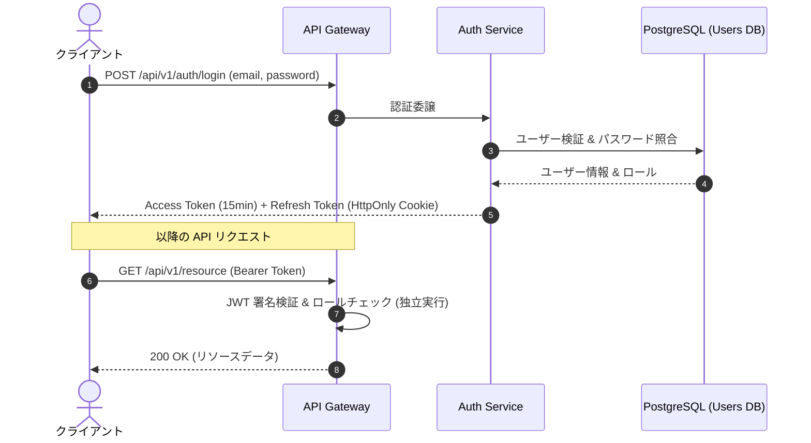

# 認証・認可基盤アーキテクチャ

## 1. アーキテクチャ概要
要件定義 [REQ-USER-01](../02_requirements/req_user_management.md) に基づき、スケーラビリティと耐障害性を確保するため、セッションステートレスな JWT 方式を採用する。

## 2. トークン仕様
1. **Access Token**:
   - 形式: JWT (JSON Web Token)
   - 署名アルゴリズム: RS256 (非対称暗号)
   - ペイロード: `sub (user_id)`, `role`, `email`, `exp`, `iat`
   - 有効期間: 15 分
2. **Refresh Token**:
   - 形式: ランダム暗号文字列 (Opaque Token)
   - 保存先: Redis (ホワイトリスト管理) + クライアント側 Secure HttpOnly Cookie
   - 有効期間: 7 日 (ローテーション方式)

# 関連ドキュメント
* 要件定義: [ユーザー管理機能要件](../02_requirements/req_user_management.md)
* 詳細設計: [Users テーブル定義](../04_detailed_designs/table_users.md)
* 詳細設計: [ログイン API 仕様](../04_detailed_designs/api_auth_login.md)
* 意思決定: [ADR-001: JWT によるステートレス認証の採用](../05_decisions/adr_001_jwt_auth.md)

# Citations
[1] [システム基本設計書 第2版](raw/03_basic_designs/architecture_overview.md)
